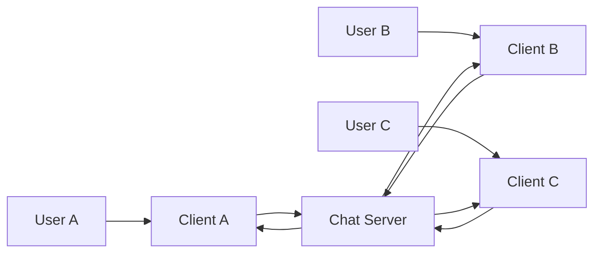
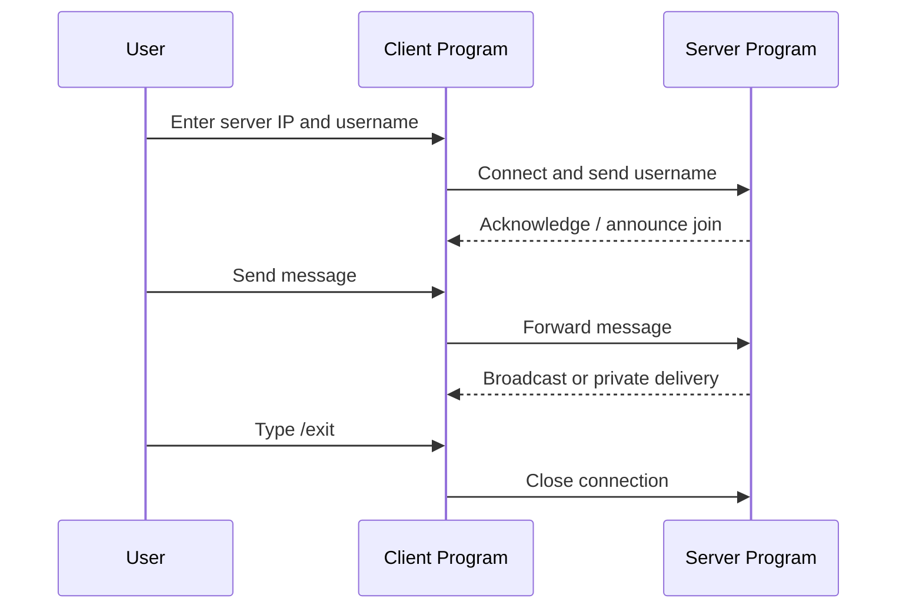

# Multi-Client TCP Chat System

A terminal-based chat application written in C that uses TCP sockets to connect multiple clients to a central server over a local network or LAN.

This project demonstrates core networking concepts such as socket programming, client-server communication, input/output multiplexing with `select()`, and real-time message routing without using threads.

---

## 1. Project Overview

The system consists of two main programs:

- `server.c`: listens for incoming client connections, tracks connected users, and forwards messages.
- `client.c`: connects to the server, accepts a username, and allows the user to send or receive messages.

The server acts as a central hub for all communication. Messages sent by one client are either:

- broadcast to all connected users, or
- delivered privately to a specific user.

---

## 2. Features

- Multi-client chat support
- Real-time public messaging
- Private messaging using `/msg username message`
- Join and disconnect notifications
- Timestamped messages
- Colored terminal output for readability
- Dynamic server IP input from the client
- Simple build workflow with `make`

---

## 3. Architecture

The application follows a classic client-server architecture.

### Server Responsibilities

The server:

- creates a TCP socket
- binds it to port `8080`
- listens for incoming connections
- accepts multiple clients
- stores usernames and socket descriptors
- broadcasts public messages
- sends private messages to the intended recipient
- handles disconnect events gracefully

### Client Responsibilities

Each client:

- connects to the server using its IP address and port
- sends a username to the server
- reads keyboard input and sends messages
- receives incoming messages from the server
- can exit using `/exit`

---

## 4. High-Level Data Flow Diagram (DFD)

The following diagram shows the main flow of data between users, client applications, and the server.



### Level 1 DFD

```text
[User] --> [Client Application] --> [TCP Socket]
                                      |
                                      v
                                [Chat Server]
                                      |
                                      +--> [Validate / Parse Message]
                                      +--> [Broadcast to All]
                                      +--> [Send Private Message]
                                      +--> [Notify Join/Leave]
```

### Message Flow

1. A client connects to the server.
2. The client sends its chosen username.
3. The server registers the user and announces the join.
4. When a user sends a message:
   - a normal message is broadcast to all connected clients
   - a private message is forwarded only to the target client
5. When a client disconnects, the server notifies the remaining clients.

---

## 5. Communication Model

The project uses TCP (Transmission Control Protocol), which provides:

- reliable delivery
- ordered data transmission
- connection-oriented communication

The server uses `select()` to monitor multiple sockets at once, allowing it to handle many clients without creating a separate thread per client.

### Core Socket Lifecycle

```text
socket()
  -> bind()
  -> listen()
  -> accept()
  -> send()/recv()
  -> close()
```

---

## 6. Project Structure

```text
multi-client-chat-system/
├── server.c
├── client.c
├── Makefile
└── README.md
```

## 7. Code Structure Overview

### Server Side: server.c

The server program is responsible for coordination and message routing.

Key responsibilities:

- creates the listening TCP socket
- accepts incoming client connections
- stores each client socket in an array
- keeps track of usernames for each connected client
- monitors sockets with `select()`
- broadcasts normal messages to all users
- forwards private messages to the intended recipient
- handles join and disconnect events

### Client Side: client.c

The client program is responsible for local user interaction and communication with the server.

Key responsibilities:

- prompts for the server IP address
- creates a TCP connection to the server
- sends the chosen username
- reads user input from the terminal
- sends messages to the server
- receives server messages and displays them
- exits cleanly when the user types `/exit`

### Basic Interaction Sequence



---

## 8. Requirements

Before running the project, make sure you have:

- a C compiler such as GCC
- a Unix-like environment (Linux, Ubuntu, WSL, or macOS)
- access to the same local network if using multiple machines

### Install GCC on Ubuntu / Debian

```bash
sudo apt update
sudo apt install gcc
```

### Verify installation

```bash
gcc --version
```

---

## 8. Build the Project

From the project directory, run:

```bash
make
```

This builds both executables:

- `server`
- `client`

### Available Makefile Targets

```bash
make          # build both server and client
make run-server
make run-client
make clean
```

---

## 9. How to Run the Application

### Step 1: Start the Server

Open one terminal and run:

```bash
make run-server
```

You should see output similar to:

```text
Chat Server Started Successfully
Server IP   : 192.168.1.5
Server Port : 8080

Waiting for clients...
```

### Step 2: Start a Client

Open another terminal and run:

```bash
make run-client
```

The client will prompt for:

```text
Enter Server IP: 192.168.1.5
Enter Name: alice
```

### Step 3: Send Messages

- Type a normal message to broadcast it to everyone.
- Use the private message format:

```text
/msg bob hello
```

- Use `/exit` to leave the chat.

---

## 10. Running Across Multiple Devices

To connect clients from different machines:

1. Make sure all devices are on the same Wi-Fi or LAN.
2. Start the server on one machine.
3. Run the client on the other machines.
4. Enter the server machine's IP address when prompted.

### Find the server IP

On the server machine, run:

```bash
hostname -I
```

Example output:

```text
192.168.1.5
```

---

## 11. Usage Examples

### Public Message

```text
hello everyone
```

Server/client output:

```text
[16:30] alice: hello everyone
```

### Private Message

```text
/msg bob hello
```

This sends the message only to `bob`.

---

## 12. Notes and Limitations

This is a learning-oriented networking project and is not intended to be a production-grade chat service.

Current limitations include:

- fixed port `8080`
- maximum of `10` clients
- no authentication or encryption
- no message persistence or chat history
- no advanced room/channel support

---

## 13. Summary

This project is a practical introduction to building a real-time, multi-client networked application in C. It highlights how a central server can coordinate communication between many users using sockets and event-driven I/O.

Example:

```text
/msg rahul hello bhai
```

Output:

```text
[16:32] (PM) sonu -> rahul: hello bhai
```

Private messages are visible only to:
- sender
- receiver

---

# Exit Chat

To leave chat:

```text
/exit
```

---

# Example Chat

```text
[16:45] [INFO] sonu joined the chat

[16:46] rahul: hello

[16:46] YOU: hi

[16:47] (PM) rahul -> YOU: how are you?

[16:48] [INFO] rahul disconnected
```

---

# Memory Layout Concepts Used

The project indirectly uses concepts like:

- Stack Memory
- Heap Memory
- File Descriptors
- Buffers
- Socket Buffers
- Dynamic Communication Handling

---

# Error Handling Done

The project handles:
- client disconnections
- failed connections
- empty socket reads
- duplicate message display issue
- exact username matching
- private message parsing

---

# Challenges Solved During Development

- Handling multiple clients simultaneously
- Preventing duplicate terminal messages
- Exact username matching for private chat
- Concurrent socket monitoring
- Real-time terminal updates
- Managing file descriptors correctly

---

# Future Improvements

Possible future upgrades:

- File transfer support
- Chat history
- Authentication system
- GUI version
- Encryption
- Internet-wide support using ngrok/VPS
- Group chat system
- Voice chat
- epoll() based scalable server
- Multithreaded implementation

---

# Concepts Demonstrated

This project demonstrates understanding of:

- TCP Socket Programming
- Linux System Calls
- Client-Server Communication
- Networking Fundamentals
- I/O Multiplexing
- C Programming
- Memory Handling
- Real-time Systems
- Multi-client Handling

---

# Learning Outcomes

After building this project, concepts learned include:

- how TCP communication works
- how sockets work internally
- how Linux handles file descriptors
- how select() multiplexing works
- how client-server systems communicate
- how concurrent networking systems are designed

---

# Author

Developed as a Linux Socket Programming and Networking project using C.
